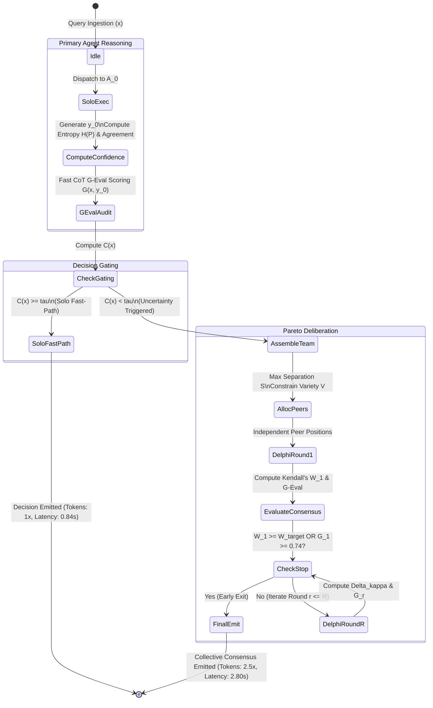

# Algorithmic Deep Dive: Diversity Parameterization, G-Eval Rubrics, and Decoupled State Protocols
**Companion Specification for CAG-Delphi**  
**Grounded In:** Lee & Kwon (2026), Kalyuzhnaya et al. (2025), Asik et al. (2023), Gonçalves et al. (2022), and Zhu et al. (2026).

---

## 1. Persona Parameterization & Diversity Coordinates (Lee & Kwon, 2026)

To eliminate the discursive friction proved by Lee & Kwon (2026) while maximizing hypothesis exploration, agents are parameterized across two distinct orthogonal layers:

```
                                    FLEXIBILITY & DISCRETION (+1.0)
                                                  │
                                                  │
                    CLAN (Collaborate)            │            ADHOCRACY (Create)
                    b_clan = [-1.0, +1.0]         │            b_adhoc = [+1.0, +1.0]
                    - Human development           │            - Innovation & agility
                    - Mentorship & cohesion       │            - Experimentation & growth
                                                  │
       INTERNAL FOCUS ────────────────────────────┼──────────────────────────── EXTERNAL FOCUS
       (-1.0)                                     │                                      (+1.0)
                                                  │
                    HIERARCHY (Control)           │            MARKET (Compete)
                    b_hier = [-1.0, -1.0]         │            b_market = [+1.0, -1.0]
                    - Formal rules & stability    │            - Fast results & speed
                    - Error mitigation            │            - Competitive edge
                                                  │
                                                  │
                                     STABILITY & CONTROL (-1.0)
```

### A. Competing Values Framework (CVF) Coordinate Space
Each agent $A_i$ is assigned a belief orientation coordinate vector $\mathbf{b}_i = (x_{\text{focus}}, y_{\text{structure}}) \in [-1.0, 1.0]^2$:
1. **Clan Archetype ($\mathbf{b}_1 = [-1.0, 1.0]$):** Focuses on consensus, ethical safeguards, and stakeholder alignment.
2. **Adhocracy Archetype ($\mathbf{b}_2 = [1.0, 1.0]$):** Focuses on innovative hypotheses, edge-case generation, and divergent thinking.
3. **Market Archetype ($\mathbf{b}_3 = [1.0, -1.0]$):** Focuses on execution efficiency, speed, hard trade-offs, and bottom-line utility.
4. **Hierarchy Archetype ($\mathbf{b}_4 = [-1.0, -1.0]$):** Focuses on statutory compliance, logical verification, precision, and error minimization.

### B. Mathematical Separation Metric ($S$)
For an ensemble $\mathcal{A} = \{A_1, \dots, A_m\}$ of size $m$, the continuous Separation diversity is:
$$S(\mathcal{A}) = \frac{1}{\sqrt{8}} \cdot \left[ \frac{2}{m(m-1)} \sum_{1 \le i < j \le m} \|\mathbf{b}_i - \mathbf{b}_j\|_2 \right] \in [0.0, 1.0]$$
- When agents are chosen from opposing quadrants (e.g., Clan + Market, or Adhocracy + Hierarchy), pairwise Euclidean distance $\|\mathbf{b}_i - \mathbf{b}_j\|_2 = \sqrt{(1 - (-1))^2 + (1 - (-1))^2} = \sqrt{8} \approx 2.828$.
- Normalized separation achieves maximum value $S(\mathcal{A}) = 1.0$.

### C. Constrained Variety Metric ($V$)
The categorical persona Variety is quantified over Big Five personality archetypes:
$$V(\mathcal{A}) = 1 - \sum_{k=1}^K \left(\frac{n_k}{m}\right)^2$$
- In the dysfunctional condition identified in Lee & Kwon (2026), agents had widely divergent Big Five traits (e.g., high Neuroticism vs. high Extraversion), generating discursive friction that degraded consensus quality ($W = 0.42$).
- Under our Pareto allocation policy, all peer agents are standardized to an **Analytical-Conscientious** communicative style ($n_{\text{analytical}} = m \implies V(\mathcal{A}) = 0.0$).
- **The Core Architectural Innovation:** We achieve **Maximal Cognitive Separation ($S \approx 0.85\text{--}1.0$)** with **Zero Communicative Friction ($V \approx 0.0\text{--}0.15$)**.

---

## 2. Formal G-Eval ("Jev") Chain-of-Thought Rubrics (Kalyuzhnaya et al., 2025)

G-Eval operates as an LLM-as-a-judge scoring protocol leveraging Chain-of-Thought reasoning to score decision quality along calibrated dimensions.

### A. The 4-Dimensional Decision Evaluation Rubric

```
========================================================================================
Dimension            Weight   Description & Criteria
========================================================================================
1. Factuality &      0.30     Evaluates whether claims are directly grounded in the
   Groundedness               input query or provided statutory/technical facts.
                              (1 = Hallucinatory, 5 = Flawlessly grounded).
----------------------------------------------------------------------------------------
2. Analytical        0.30     Evaluates the logical deductive validity of intermediate
   Coherence                  reasoning steps and avoidance of contradictions.
                              (1 = Self-contradicting, 5 = Ironclad syllogisms).
----------------------------------------------------------------------------------------
3. Domain Precision  0.25     Evaluates correctness of technical/legal/urban terms
   & Completeness             and adherence to specific institutional rules.
                              (1 = Vague/generalist, 5 = Highly expert/complete).
----------------------------------------------------------------------------------------
4. Uncertainty &     0.15     Evaluates whether edge cases and ambiguities are properly
   Calibration                identified rather than brushed aside with false confidence.
                              (1 = Recklessly overconfident, 5 = Perfectly calibrated).
========================================================================================
```

### B. Continuous G-Eval Score Formulation
Given decision response $y$ and query $x$, the G-Eval evaluator computes integer scores $s_d \in \{1, 2, 3, 4, 5\}$ for each dimension $d \in \{1, 2, 3, 4\}$.  
The continuous G-Eval score $\mathcal{G}(x, y) \in [0.0, 1.0]$ is:
$$\mathcal{G}(x, y) = \sum_{d=1}^4 w_d \cdot \left(\frac{s_d - 1}{4}\right)$$

### C. Empirical Score Benchmarking (Kalyuzhnaya et al., 2025 Table 3)
- **Standalone LLM Solo Output:** $\mathcal{G}_{\text{solo}} \in [0.30, 0.38]$ (Sub-optimal precision, susceptible to hallucinations).
- **Unconditional Multi-Agent Output:** $\mathcal{G}_{\text{uncond}} \in [0.68, 0.74]$ (Robust consensus, high domain precision).
- **CAG-Delphi Target Convergence Threshold:** $\mathcal{G}_{\text{target}} = 0.74$.
  - When early-round Delphi consensus reaches $\mathcal{G} \ge 0.74$, deliberation halts immediately.

---

## 3. Decoupled Execution State Machine & Petri Net Protocol

Synthesizing decoupled MCTS principles (Asik et al., 2023) and formal organizational verification (Gonçalves et al., 2022):



### A. State Transition Invariants
1. **Zero Peer Overhead Invariant:** If $\mathcal{C}(x) \ge \tau$, no external agent process or message queue is ever initialized. Tokens consumed $\equiv \text{Tokens}(A_0, y_0)$.
2. **Consensus Convergence Invariant:** Iteration stops at the earliest round $r^*$ where $\Delta \kappa_r = |W_r - W_{r-1}| < 0.05$ or $\mathcal{G}_r \ge 0.74$, preventing infinite debate cycles.
3. **Hard Token Budget Bound:** If cumulative token spend reaches $\beta = 4,000$ tokens, iteration is forcefully terminated and the current plurality consensus is emitted.
